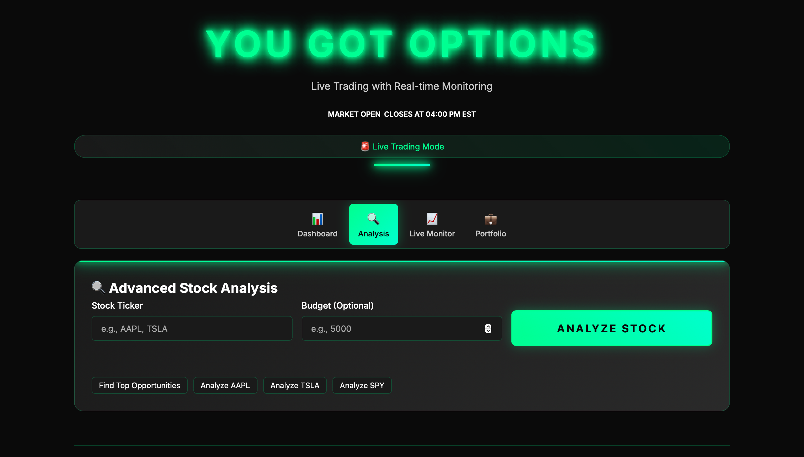

# 🎯 YOU GOT OPTIONS – Real-Time Trading & Market Analysis Platform
A full-featured trading analysis prototype with dashboards, signal scanning, advanced analysis, and real-time monitoring. Features a neon-themed UI and interactive tools for exploring market opportunities.

Live Demo:  
👉 https://you-got-options.onrender.com

Run locally at:  
http://127.0.0.1:5000

---

## 🌟 Features

### 📊 Real Market Dashboard
View real-time market opportunity scans, trending signals, and actionable insights.

### 🔍 Advanced Analysis Tools
Input ticker symbols and an optional budget to analyze stock opportunities or generate trade logic.

### 📈 Live Trade Monitor
Customize:
- Symbol  
- Trade Type  
- Entry Price  
- Stop Loss  
- Take Profit  
- Contracts/Shares  
- Alert Email  

The system monitors live market movement in real time.

### 🧭 Smooth Multi-Tab Navigation
Tabs include:
- Dashboard  
- Analysis  
- Live Monitor  
- Portfolio  

### ⚡ AI-Assisted Development
Built using ChatGPT + Warp for rapid prototyping, refactoring, and feature enhancements.

---

## 🟩 Screenshots

### Dashboard  


### Analysis Page  


### Live Trade Monitor  


---

## 🛠 Tech Stack

**Frontend:**  
- HTML  
- CSS (Neon theme)  
- JavaScript  

**Backend (optional versions):**  
- Python  
- Flask  

**Tools & Deployment:**  
- Git / GitHub  
- Render  
- ChatGPT + Warp  

---

## 📂 Project Structure

```
you-got-options/  
├── index.html  
├── styles.css  
├── script.js  
├── app.py (optional)  
├── static/  
│   └── screenshots/  
├── README.md  
└── requirements.txt
```

---

## ▶️ Installation

### Clone the repository

```bash
git clone https://github.com/Elliott1985/you-got-options.git
cd you-got-options
```

### Frontend Setup

1. **Open in Browser:**
   ```bash
   open index.html
   ```
   Or use a local server:
   ```bash
   python -m http.server 8000
   ```
   Then visit `http://localhost:8000`

### Backend Setup (Optional)

1. **Create Virtual Environment:**
   ```bash
   python -m venv venv
   source venv/bin/activate  # On Windows: venv\Scripts\activate
   ```

2. **Install Dependencies:**
   ```bash
   pip install -r requirements.txt
   ```

3. **Run Flask Server:**
   ```bash
   python app.py
   ```

4. **Access Application:**
   ```
   http://localhost:5000
   ```

---

## ▶️ Usage

### Dashboard  
Shows live market signals and opportunities.

### Analysis  
Analyze tickers with optional budget.

### Live Monitor  
Track trades with stop loss + take profit.

### Portfolio  
(If implemented)

---

## 👨‍💻 My Role & Contributions

I built:

- The UI/UX neon theme  
- Navigation system  
- Market dashboard  
- Advanced analysis workflow  
- Live trade monitor  
- Deployment pipeline  
- All code written or refined using AI-assisted development (ChatGPT + Warp)

This project demonstrates:
✔ Front-end engineering  
✔ App structure  
✔ Deployment skills  
✔ Python + JS synergy  
✔ Real-world problem-solving  

---

## 📊 Technical Features

### RSI-Based Trading Strategy
- **RSI < 30**: Oversold (Bullish signal)
- **RSI > 70**: Overbought (Bearish signal)
- **30-70**: Neutral (Hold signal)

### Real-Time Market Data
- Live price feeds via market APIs
- Real-time P&L calculations
- Instant alert notifications

### Dynamic UI
- Neon-themed dark mode interface
- Responsive design for all devices
- Smooth animations and transitions
- Multi-tab navigation system

---

## 🔧 Configuration

### API Keys (if using backend)
Create a `.env` file:
```
API_KEY=your_api_key_here
SECRET_KEY=your_secret_key_here
```

### Customizing Themes
Edit `styles.css` to modify:
- Color scheme
- Font styles
- Animation speeds
- Layout dimensions

---

## 📡 API Endpoints (Backend)

| Endpoint | Method | Description |
|----------|--------|-------------|
| `/` | GET | Main dashboard |
| `/api/analyze` | POST | Analyze stock with ticker |
| `/api/market` | GET | Market overview data |
| `/api/trades` | GET | Retrieve trade history |
| `/api/positions` | GET | Get active positions |
| `/api/health` | GET | Health check |

---

## 🧪 Testing

### Frontend Testing
```bash
# Open browser developer console
# Check for any JavaScript errors
# Test all tabs and navigation
```

### Backend Testing (if implemented)
```bash
pytest tests/
# or
python -m unittest discover
```

---

## 🚢 Deployment

### Deploy to Render
1. Connect your GitHub repository to Render
2. Set environment variables in Render dashboard
3. Deploy:
   ```bash
   git push origin main
   ```

### Deploy to Heroku
```bash
heroku create you-got-options
git push heroku main
```

### Deploy to AWS
- Use AWS Lambda for serverless
- Configure API Gateway for endpoints
- Use CloudFront for CDN

---

## 🔗 Deployment
Hosted on Render:  
https://you-got-options.onrender.com

---

## 📚 Documentation

- **Frontend Code**: `script.js` - Main application logic
- **Styling**: `styles.css` - UI theme and layouts
- **Backend**: `app.py` - Flask server (if implemented)
- **Data**: `static/` - Screenshots and assets

---

## 🤝 Contributing

Contributions are welcome! To contribute:

1. Fork the repository
2. Create a feature branch:
   ```bash
   git checkout -b feature/your-feature-name
   ```
3. Make your changes
4. Commit your changes:
   ```bash
   git commit -m "Add your feature description"
   ```
5. Push to the branch:
   ```bash
   git push origin feature/your-feature-name
   ```
6. Open a Pull Request

### Code Standards
- Write clean, readable code
- Add comments for complex logic
- Follow existing code style
- Test before submitting PR

---

## 📜 License  
This project is for educational and portfolio purposes.

---

## ⚠️ Disclaimer

**Educational Purposes Only** - This application is for learning and research purposes only. It should not be considered as financial advice. Options trading involves significant risk and can result in substantial losses. Always consult with a qualified financial advisor before making trading decisions.

---

## 🎯 Future Enhancements

- [ ] Live market data integration (Alpaca, IEX Cloud)
- [ ] Advanced charting library (TradingView Lightweight Charts)
- [ ] Machine learning for signal prediction
- [ ] Mobile app (React Native)
- [ ] Discord/Slack notifications
- [ ] Backtesting engine
- [ ] Paper trading simulation
- [ ] Multi-account support
- [ ] Portfolio optimization tools
- [ ] Risk analysis dashboard

---

## 👥 Credits

Built with **ChatGPT + Warp** AI-assisted development workflow, showcasing modern trading UI/UX design and rapid prototyping capabilities.

---

## 📞 Support

For questions, issues, or suggestions:
- Open an issue on GitHub
- Check the documentation
- Review the source code comments

---

**Happy Trading! 📈**

v2.0 - Advanced Trading Platform with Real-time Monitoring
